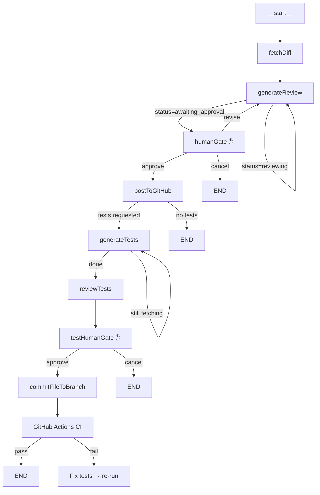

# Review Pipeline Orchestration

This document explains how the HITL (Human-In-The-Loop) review pipeline works
end-to-end: from GitHub webhook through LangGraph + DeepSeek, to the desktop
approval gate, and finally to PR comments on GitHub.

## Two Parallel Pipelines

Every PR triggers two independent pipelines. This document covers the **review**
pipeline (right side). See [scoring.md](scoring.md) for the audit pipeline.

```
PR opened on GitHub
  │
  ├─→ Pipeline 1: SCORING (automated, no human gate)
  │     BullMQ → AuditProcessor (inline | sdk | sandbox)
  │     → compliance%, efficiency%, coverage%
  │     → Stored in ai_audits → Dashboard + Desktop score bar
  │
  └─→ Pipeline 2: REVIEW (HITL, this document)
        BullMQ → LangGraph (two-phase: code review + optional test generation)
        → Review text + test code → Desktop app shows diff + review + tests
        → Human approves each phase → Octokit posts comments to GitHub
```

## Two-Phase Pipeline

The review pipeline has two phases. Phase 1 (code review) always runs. Phase 2
(test generation) is optional — the human selects it via checkboxes on approve.

```
Phase 1: Code Review (always runs)
──────────────────────────────────
  fetchDiff → generateReview ⇄ ReadFile tool loop → humanGate ✋
    │                                                    │
    │  Human can: approve, revise (max 3 rounds),        │
    │  add personal notes, cancel                        │
    │                                                    │
    ▼                                                    ▼
  postToGitHub ──→ check: tests requested?
                       │
              ┌────────┴────────┐
              │                 │
              ▼                 ▼
 Phase 2:  generateTests       END
               │
               ▼
          reviewTests
               │
               ▼
          testHumanGate ✋
               │
      ┌────────┴────────┐
      │                 │
      ▼                 ▼
  Approve Tests     Discard Tests
      │
      ▼
  commitFileToBranch → PR branch
      │
      ▼
  GitHub Actions → test.yml
      │
      ├─ ✅ → merge
      └─ ❌ → fix → re-run → merge
```

## LangGraph State Machine

### Graph Topology

The graph has 8 nodes, 2 interrupt points, and conditional routing at 4 points.



### State Definition

State is defined via LangGraph's `Annotation.Root()` with typed fields and
reducers. The state has 28 fields across two phases.

**Phase 1 fields (code review):**

| Field | Type | Purpose |
|---|---|---|
| `prNumber` | `number` | PR number for display and GitHub API |
| `prTitle` | `string` | PR title for context |
| `commitSha` | `string` | Commit SHA for file fetching |
| `owner` / `repo` | `string` | Repository identifiers |
| `diffContent` | `string` | PR diff injected at graph.invoke() time |
| `taskDescription` | `string` | PR body — requirement context |
| `guidelines` | `string` | Active org coding standards formatted for LLM |
| `repoContext` | `string` | Directory listing + key files for cross-file context |
| `reviewText` | `string` | Final code review output from LLM |
| `status` | enum | Drives Phase 1 routing: `fetching` → `reviewing` → `awaiting_approval` → `posting` → `done` / `cancelled` |
| `messages` | `BaseMessage[]` | Conversation history with concat reducer — accumulates across tool-loop iterations |
| `toolCallCount` | `number` | Loop guard — prevents infinite ReadFile cycles, capped at 10 |
| `humanNotes` | `string` | Reviewer's personal annotations — appended to GitHub comment |
| `humanFeedback` | `string` | Feedback for revision — injected as "Reviewer Feedback" block, consumed once |
| `revisionCount` | `number` | How many times the human requested revision (max 3) |

**Phase 2 fields (test generation):**

| Field | Type | Purpose |
|---|---|---|
| `generateTests` | `boolean` | Whether human requested test generation on approve |
| `testTypes` | `string[]` | Which test types: `['unit']`, `['integration']`, or both |
| `generatedTestsContent` | `string` | Raw test code generated by LLM |
| `testReviewText` | `string` | AI review of the generated tests |
| `testStatus` | enum | Drives Phase 2 routing: `idle` → `generating` → `reviewing_tests` → `awaiting_approval` → `posting` → `done` |
| `testMessages` | `BaseMessage[]` | Test generation conversation history (separate from code review messages) |
| `testToolCallCount` | `number` | Loop guard for test-phase ReadFile calls, capped at 8 |

## Nodes

### Phase 1 Nodes

**fetchDiff** — A pass-through node that logs the PR and transitions status to
`reviewing`. The actual diff is injected as initial state from the webhook
handler — no external fetch needed.

**generateReview** — The core code review node. On each invocation:

1. Assembles system prompt from task description, guidelines, diff, and repo context
2. If `humanFeedback` is non-empty, injects a "Reviewer Feedback" block directing the LLM
3. Calls DeepSeek API with `ReadFile` tool definition
4. If LLM requests files: fetches via GitHub API → loops back (up to 10 times)
5. If LLM produces final text: saves to `reviewText`, sets `status = 'awaiting_approval'`
6. Consumes `humanFeedback` on every execution (clears it after use)

Uses raw `fetch()` to `https://api.deepseek.com/v1/chat/completions` — no SDK,
full control over message construction and `tool_call_id` matching.

**humanGate** — Interrupt point (pass-through node). LangGraph pauses BEFORE
this node executes. The human modifies checkpoint state via `updateState()`
(approve, revise, cancel). When resumed, the conditional edge reads the
modified `status` and routes to the correct next node.

**postToGitHub** — Stub node. Sets `status = 'done'`. The actual GitHub posting
happens in `ReviewProcessor.processPostJob` before the graph resumes.

### Phase 2 Nodes

**generateTests** — LLM writes tests for the diff. On each invocation:

1. Assembles system prompt directing the LLM to read source files before writing
2. Injects repoContext (directory structure) so the LLM finds existing tests and types
3. Calls DeepSeek API with `ReadFile` tool definition — same pattern as code reviewer
4. If LLM requests files (source code, existing tests, type definitions): fetches via GitHub API → loops back (up to 8 times)
5. If LLM produces test code: saves to `generatedTestsContent`, sets `testStatus = 'reviewing_tests'`

The LLM explores: reads changed source files → reads existing test files to
match patterns → reads type definitions → generates tests that fit the project.

**reviewTests** — LLM reviews the generated tests. Checks:

1. Correctness — do the tests actually test the code changes?
2. Coverage — are edge cases, error paths, and happy paths covered?
3. Structure — are mocks appropriate, assertions meaningful?
4. Maintainability — clear test names, consistent patterns?

Produces `testReviewText` and sets `testStatus = 'awaiting_approval'`.

**testHumanGate** — Second interrupt point. Same pattern as `humanGate` —
LangGraph pauses before this node. The human sees generated test code + AI
review and approves or discards.

**postTestComment** — Stub node. Sets `testStatus = 'done'`. The actual commit
to the PR branch and CI trigger happens in `ReviewProcessor.processTestPostJob`
via `ReviewCommenter.commitFileToBranch`.

## Interrupt Mechanism

The review pipeline uses three LangGraph primitives:

```
1. checkpointer → saves graph state after every node, keyed by thread_id
2. interruptBefore → stops execution RIGHT BEFORE named nodes
3. updateState + invoke(null) → external code modifies checkpoint, then resumes
```

```ts
return graph.compile({
  interruptBefore: ['humanGate', 'testHumanGate'],  // ← two pause points
  checkpointer,                                       // ← MemorySaver
});
```

When the graph reaches a node in `interruptBefore`, it stops execution. The
checkpoint saves the current state. The `invoke()` call returns. The BullMQ
job finishes.

The human's decision enters via `graph.updateState()`:

```ts
// Approve code review:
await graph.updateState(config, { status: 'awaiting_approval' });
await graph.invoke(null, config);  // resume

// Revise (with feedback):
await graph.updateState(config, {
  humanFeedback: 'Check error handling',
  revisionCount: currentState.revisionCount + 1,
  status: 'reviewing',
});
await graph.invoke(null, config);  // loop back to generateReview
```

## BullMQ Job Lifecycle

Each review runs through up to 4 job types on the same queue.

| Job | Type | Trigger | What it does |
|---|---|---|---|
| 1 | `review-analyze` | Webhook | Runs Phase 1 graph until `humanGate` ✋, saves pending review |
| 2 | `review-revise` | Human clicks "Revise" | Updates checkpoint with feedback, resumes graph loops back to generateReview |
| 3 | `review-post` | Human clicks "Approve" | Posts code review to GitHub, optionally starts Phase 2 (test generation) |
| 4 | `test-post` | Human clicks "Approve Tests" | Commits test file to PR branch via Octokit, triggering CI (test.yml) |

## DeepSeek Tool Loop

Both `generateReviewNode` and `generateTestsNode` implement a manual tool-use
loop. The pattern is identical:

### 1. Build message array

```typescript
const apiMessages = [
  { role: 'system', content: systemPrompt },
  { role: 'user', content: userPrompt },
  // ... state.messages from previous turns (assistant responses + tool results)
];
```

### 2. Call DeepSeek API

```typescript
const response = await fetch('https://api.deepseek.com/v1/chat/completions', {
  method: 'POST',
  headers: { Authorization: `Bearer ${apiKey}` },
  body: JSON.stringify({
    model: 'deepseek-chat',
    messages: apiMessages,
    tools: [ReadFile tool definition],
    temperature: 0.3,
    max_tokens: 4096,
  }),
});
```

Model-agnostic — change the URL, model name, and API key to switch providers.

### 3. Branch on response

**If `tool_calls` present** (and under call limit):
- Creates `AIMessage` with `tool_calls` attached
- Executes each tool: `ReadFile` fetches from GitHub Contents API using the commit SHA
- Creates `ToolMessage` per result with `tool_call_id` matching the request
- Returns partial state with new messages → LangGraph loops back

**If no `tool_calls`** (or limit reached):
- Saves `choice.content` as final output (`reviewText` or `generatedTestsContent`)
- Sets status to `awaiting_approval` or `reviewing_tests`

### 4. tool_call_id matching

DeepSeek requires each `ToolMessage` to reference the `tool_call_id` from the
corresponding assistant request. Missing or mismatched IDs cause API errors.

## Tool Call Parallelism

The LLM decides which files to request and whether to batch them:

```
Independent files → batched in one response:
  tool_calls: [ReadFile("auth.ts"), ReadFile("payment.ts")]
  → Same turn. LLM assumes no dependency.

Dependent files → split across turns:
  Turn 1: ReadFile("auth.ts")
  Turn 2: auth.ts imports session.ts → ReadFile("session.ts")
  → Different turns. LLM needed auth.ts result before deciding.
```

The LLM's batching is its parallelism expression. Calls in the same batch
are independent. Calls across turns are sequential by necessity.

Execution is sequential within a batch (`for...of` with `await`). This can
be optimized with `Promise.all` because same-batch calls are always independent.

## Desktop UI

The decision gate has distinct states for each pipeline phase:

| State | Buttons | Controls |
|---|---|---|
| No review | All disabled | Hidden |
| `reviewing` | All disabled | Hidden |
| `awaiting_approval` | Approve, Cancel, Revise | Notes, revision badge, test checkboxes |
| `posting` | All disabled | Hidden |
| `done` | All disabled | Hidden |
| `cancelled` | All disabled | Hidden |
| `awaiting_test_approval` | "Approve Tests & Commit", "Discard Tests" | Hidden |

**Test generation checkboxes** (visible only on `awaiting_approval`):
- `☐ Write unit tests`
- `☐ Write integration tests`
- Dynamic hint: "Will generate: unit and integration tests"

## Controller API

All actions go through a single endpoint:

```
POST /api/v1/reviews/:id/action

Phase 1:
  { action: 'approve', notes?, generateTests?, testTypes? }
  { action: 'revise', feedback: string }
  { action: 'cancel' }

Phase 2:
  { action: 'approve-tests' }
  { action: 'cancel-tests' }
```

Additional endpoints:
- `POST /api/v1/reviews/start` — Start review from webhook
- `GET /api/v1/reviews/pending` — List pending code reviews
- `GET /api/v1/reviews/tests/pending` — List pending test reviews
- `GET /api/v1/reviews/:id` — Get review + test review by thread ID

## Configuration

All configuration via environment variables:

| Variable | Purpose | Example |
|---|---|---|
| `DEEPSEEK_API_KEY` | DeepSeek API authentication | `sk-...` |
| `GITHUB_TOKEN` | GitHub API for file fetching + PR comments | `ghp_...` |

## Production Hardening

Current limitations and their resolutions:

| Limitation | Resolution |
|---|---|
| `MemorySaver` — checkpoints lost on restart | PostgresSaver for persistence |
| In-memory review store (`Map`) — lost on restart | Redis or database-backed store |
| Sequential tool execution within batches | `Promise.all` for same-batch calls |
| Single ReadFile tool for test generation | Same pattern as code reviewer — already sufficient with repoContext |
| No test revision loop in Phase 2 | Intentional — one-shot commit; CI proves correctness. Human fixes on GitHub if needed. |

## Files Referenced

| File | Purpose |
|---|---|
| `apps/backend/src/modules/reviews/review.graph.ts` | LangGraph graph: 8 nodes, 2 interrupts, 4 conditional edges |
| `apps/backend/src/modules/reviews/review.processor.ts` | BullMQ worker: 4 job types |
| `apps/backend/src/modules/reviews/reviews.service.ts` | In-memory review + test review stores |
| `apps/backend/src/modules/reviews/reviews.controller.ts` | REST + WebSocket: action endpoint |
| `apps/backend/src/modules/reviews/review-commenter.ts` | Octokit: post PR review comments |
| `apps/desktop/src/review-gate.js` | HITL UI: gate states, checkboxes, actions |
| `apps/desktop/src/App.html` | Desktop layout: reviewer controls, decision gate |
| `docs/langgraph-guide.md` | Architecture guide: skills, MCP, patterns |
