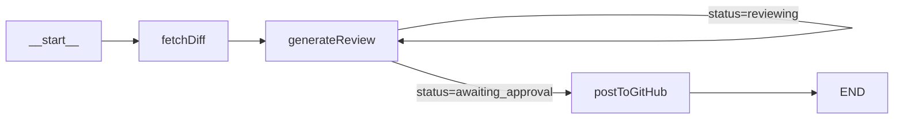

# Review Pipeline Orchestration

This document explains how the HITL (Human-In-The-Loop) review pipeline works
end-to-end: from GitHub webhook through LangGraph + DeepSeek, to the desktop
approval gate, and finally to a PR comment on GitHub.

## Two Parallel Pipelines

Every PR triggers two independent pipelines. This document covers the **review**
pipeline (right side). See [scoring.md](scoring.md) for the audit pipeline.

```
PR opened on GitHub
  │
  ├─→ Pipeline 1: SCORING (automated, no human gate)
  │     BullMQ → AuditProcessor (inline | sdk | sandbox)
  │     → compliance%, efficiency%, coverage%
  │     → Stored in ai_audits → Dashboard + Desktop score bar
  │
  └─→ Pipeline 2: REVIEW (HITL, this document)
        BullMQ → LangGraph (fetchDiff → generateReview ⇄ tool loop → interrupt)
        → Review text → Desktop app shows diff + review
        → Human approves → Octokit posts comment to GitHub
```

The audit pipeline runs automatically and is always scored. The review pipeline
pauses for human approval before publishing anything to GitHub.

## LangGraph State Machine

The graph has three nodes connected by two edges and one conditional loop.



### State definition

State is defined via LangGraph's `Annotation.Root()` with typed fields and
reducers. Key fields:

| Field | Type | Purpose |
|---|---|---|
| `messages` | `BaseMessage[]` | Conversation history, uses concat reducer to accumulate across loop iterations |
| `toolCallCount` | `number` | Loop guard — prevents infinite re-entry, capped at 10 |
| `status` | enum | Drives conditional routing: `fetching` → `reviewing` → `awaiting_approval` → `posting` → `done` |
| `reviewText` | `string` | Final review output, set when DeepSeek returns content without tool_calls |
| `diffContent` | `string` | PR diff injected at graph.invoke() time |
| `guidelines` | `string` | Active org coding standards formatted for the LLM prompt |
| `repoContext` | `string` | Directory listing + key files for cross-file analysis context |

### Nodes

**fetchDiff** — A pass-through node that logs the PR and transitions status to
`reviewing`. The actual diff is injected as initial state from the webhook
payload, not fetched inside the graph.

**generateReview** — The core node. Handles the DeepSeek API call and the tool
execution loop. See [DeepSeek Tool Loop](#deepseek-tool-loop) below for the
internal mechanism.

**postToGitHub** — A terminal node that sets `status: 'done'`. In the current
implementation the actual GitHub API call lives in `ReviewProcessor.processPostJob()`
outside the graph (see [Production Hardening](#production-hardening) for why this
should move into the node).

### Conditional routing

After `generateReview` executes, `afterGenerateReview(state)` checks
`state.status`:

- `'reviewing'` → re-enter `generateReview` (tool calls were executed, loop back)
- `'awaiting_approval'` → proceed to `postToGitHub` (review is complete)

### Interrupt

The graph is compiled with `interruptBefore: ['postToGitHub']`. This pauses
execution after `generateReview` produces the final review text but before
anything is posted. The state is checkpointed in `MemorySaver` keyed by
`thread_id` (a UUID). The interrupt is what enables the human approval gate —
the graph will not continue past this point until `graph.invoke(null, config)`
is called again.

### Checkpointing

`MemorySaver` stores graph state in process memory. State is saved at every
graph transition. This is what allows the two-job split to work: Job 1 writes
the checkpoint, Job 2 reads it. The checkpoint key is the `thread_id`
configured via `{ configurable: { thread_id } }`.

**Caveat:** `MemorySaver` is in-memory only. A process restart loses all
checkpoints. See [Production Hardening](#production-hardening).

## DeepSeek Tool Loop

The `generateReviewNode` function implements a manual tool-use loop. On each
invocation it:

### 1. Builds the message array

```typescript
const apiMessages = [
  { role: 'system', content: systemPrompt },
  { role: 'user',  content: userPrompt },   // task + standards + diff + repo context
  // ... state.messages appended from previous turns (assistant responses + tool results)
];
```

The `state.messages` accumulator stores `AIMessage` and `ToolMessage` objects
from prior loop iterations. On re-entry, the full conversation history is
reconstructed — DeepSeek receives the same context it would in a continuous
session.

### 2. Calls DeepSeek API

Uses raw `fetch()` to `https://api.deepseek.com/v1/chat/completions` (not an
SDK). This gives full control over message construction and tool_call_id
matching.

```typescript
const response = await fetch('https://api.deepseek.com/v1/chat/completions', {
  method: 'POST',
  headers: { Authorization: `Bearer ${apiKey}` },
  body: JSON.stringify({
    model: 'deepseek-chat',
    messages: apiMessages,
    tools: [/* ReadFile function definition */],
    temperature: 0.3,
    max_tokens: 4096,
  }),
});
```

### 3. Branches on response

**If tool_calls present** (and `toolCallCount < 10`):
- Creates an `AIMessage` with the `tool_calls` attached
- Executes each tool: `ReadFile` fetches from GitHub's Contents API
- Creates a `ToolMessage` per result with `tool_call_id` matching the request
- Returns `{ messages: [assistantMsg, ...toolResults], toolCallCount: +1, status: 'reviewing' }`
- The conditional edge routes back to `generateReview`

**If no tool_calls** (final response):
- Extracts `choice.content` as `reviewText`
- Returns `{ reviewText, status: 'awaiting_approval', messages: [...] }`
- The conditional edge routes to `postToGitHub` (blocked by interrupt)

### Tool: ReadFile

The graph exposes a single tool to the LLM:

```typescript
{
  type: 'function',
  function: {
    name: 'ReadFile',
    description: 'Read the full content of a file from the repository',
    parameters: {
      type: 'object',
      properties: { path: { type: 'string' } },
      required: ['path'],
    },
  },
}
```

Tool execution hits GitHub's Contents API at the PR's commit SHA, decodes the
base64 response, and returns the file content. If the file is not found or the
API call fails, it returns `'[File not found]'` and continues — the LLM can
adapt.

### Loop safety

- **Hard cap**: `toolCallCount < 10` — the node will not re-enter after 10
  tool-call iterations. The review is returned with whatever content the LLM
  has produced at that point.
- **Cost**: Each re-entry sends the full accumulated message history to
  DeepSeek, so conversation growth is linear with each tool call.

## BullMQ Two-Job Split

The review lifecycle is split across two BullMQ jobs, both handled by the
same `ReviewProcessor` worker. This split exists because the human approval
gap can span minutes or hours — you cannot hold a single job open that long.

### Job 1: `review-analyze`

Enqueued by `ReviewsService.startReview()`.

1. Injects `DEEPSEEK_API_KEY` and `GITHUB_TOKEN` via `setGraphDependencies()`
2. Builds LangGraph, calls `graph.invoke(initialState, { configurable: { thread_id } })`
3. Graph runs `fetchDiff` → `generateReview` (with tool loops) → pauses at interrupt
4. Calls `reviewsService.savePendingReview()` — stores review text in memory,
   emits `review:complete` via WebSocket
5. Returns `{ threadId, status: 'awaiting_approval' }`

### Job 2: `review-post`

Enqueued by `ReviewsService.approveReview()` when the human clicks [Approve].

1. Loads checkpoint via `graph.getState(config)`
2. Posts review comment to GitHub via `ReviewCommenter.postComment()`
3. Resumes graph via `graph.invoke(null, config)` — runs `postToGitHubNode`
4. Calls `reviewsService.updateReviewStatus(threadId, 'done')`

### Thread ID as bridge

The `thread_id` is a UUID generated in `ReviewsService.startReview()`. It is:
- Stored in the `ReviewJobData` for Job 1
- Passed to Job 2 via `{ threadId }` in the job payload
- Used as the `configurable.thread_id` for LangGraph checkpointing
- Used as the key in `ReviewsService`'s in-memory Map
- Used as the route parameter in `POST /reviews/:id/approve`

No state is shared between the two jobs except this ID. The checkpoint and
the pending review store are the only state carriers.

## Why the Queue Pattern

The BullMQ queue serves three purposes, none of which are about parallelism
(the default concurrency is 1):

### 1. Async decoupling (primary)

GitHub webhooks expect a response within 10 seconds. The DeepSeek review loop
takes 15–45 seconds. Without the queue, the webhook handler would have to
`await graph.invoke()` synchronously and the HTTP connection would time out.
Instead:

```
Webhook → enqueue job (2ms) → 202 Accepted
                              ↓
                        worker picks up job later
```

### 2. Backpressure

If multiple PRs open in quick succession, jobs queue in Redis rather than
overwhelming the DeepSeek API with concurrent connections.

### 3. Reliability

BullMQ handles job retries on failure. If the DeepSeek API returns a 429 or
503, the job is retried automatically.

## WebSocket + Polling Dual Channel

The desktop app uses both push and pull for resilience:

| Channel | Protocol | Events |
|---|---|---|
| WebSocket | Socket.IO (`/reviews` namespace) | `review:started`, `review:token`, `review:complete`, `review:status` |
| Polling | HTTP `GET /api/v1/reviews/pending` | Every 3 seconds, merges with local state |

The WebSocket provides instant updates. The polling serves as a fallback
for missed events (disconnects, reconnects, page reloads). The merge logic
in `fetchPendingReviews()` updates existing reviews by `threadId` and appends
new ones — it never duplicates.

## End-to-End Flow

```
1. GitHub PR webhook
   POST /webhooks/github (HMAC validated)
   → WebhooksService.processGitHubWebhook()
   → ReviewsService.startReview()
   → Enqueues "review-analyze" job

2. ReviewProcessor picks up job
   → Injects DEEPSEEK_API_KEY + GITHUB_TOKEN
   → Builds LangGraph with thread_id
   → graph.invoke(initialState)

3. LangGraph executes
   → fetchDiff: status → 'reviewing'
   → generateReview: calls DeepSeek API
     ├─ tool_calls? → fetch file from GitHub → loop back (up to 10×)
     └─ final text → status → 'awaiting_approval'
   → Interrupt before postToGitHub: graph pauses

4. ReviewProcessor saves result
   → ReviewsService.savePendingReview()
   → Emits 'review:complete' via WebSocket

5. Desktop app receives event
   → Renders review text in right pane
   → Shows "PAUSED: Awaiting Human Approval"
   → Enables [Approve] and [Cancel] buttons
   → Fetches scores from audits API for score bar

6. Human clicks [Approve]
   → POST /api/v1/reviews/:id/approve
   → ReviewsService.approveReview()
   → Enqueues "review-post" job

7. ReviewProcessor picks up job
   → graph.getState(config) — loads checkpoint
   → reviewCommenter.postComment() — posts to GitHub PR
   → graph.invoke(null, config) — resumes past interrupt
   → Updates status to 'done'

8. GitHub PR
   → AI review appears as a comment
   → Human reviewer on GitHub uses it to inform merge decision
```

## LLM API Separation

The review pipeline and audit pipeline use different LLM APIs. They are
completely independent — no API key is shared between them:

| Pipeline | Harness | Backend API | API Key |
|---|---|---|---|
| Reviews | LangGraph + raw `fetch` | DeepSeek (`deepseek-chat`) | `DEEPSEEK_API_KEY` |
| Audits (inline) | Regex in-process | N/A | None |
| Audits (sdk) | Claude Agent SDK (`@anthropic-ai/claude-agent-sdk`) | Anthropic (`claude-sonnet-4-20250514`) | `ANTHROPIC_API_KEY` |
| Audits (sandbox) | CodeWhale (K8s Job) | DeepSeek (`deepseek-v4-flash`) | `DEEPSEEK_API_KEY` |

## Production Hardening

The current implementation is correct for development and single-instance
deployment. For production use, three areas need attention:

### 1. Persistent checkpoints

`MemorySaver` is in-memory. A process restart between Job 1 and Job 2 loses
the checkpoint, and Job 2 throws `"No checkpoint found"`. Remediation:

- Swap `MemorySaver` for a PostgreSQL-backed or Redis-backed checkpointer
  when LangGraph support is available
- Alternative: serialize checkpoint state into the `PendingReview` record
  so `processPostJob` can reconstruct state without `getState()`

### 2. Persistent review store

`ReviewsService` uses an in-memory `Map`. A restart loses all pending reviews.
Add a `pending_reviews` table to PostgreSQL — same pattern as `ai_audits`.

### 3. Move posting into the graph node

Currently `postComment()` is called in `processPostJob` *before*
`graph.invoke()`. `postToGitHubNode` is a no-op that just sets `status: 'done'`.
If the graph resume crashes after the comment is posted, the comment exists on
GitHub but the graph never completed. The safer approach:

- Move the `ReviewCommenter.postComment()` call into `postToGitHubNode`
- Let the graph's checkpoint capture success or failure
- Wrap with LangGraph's retry policy if needed

### 4. Streaming to desktop

The `review:token` WebSocket event is wired up in the desktop but nothing
emits it. DeepSeek's API supports SSE streaming — piping `delta.content`
chunks through the WebSocket would give the reviewer incremental visibility
instead of a 30-second blank screen during analysis.
